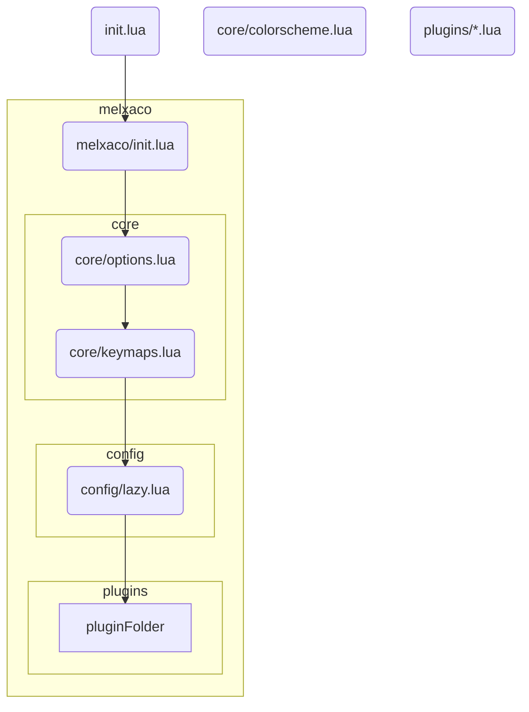

# nvim

## Configuration files

```mermaid

flowchart TD
  rootInit(init.lua)
  rootMelxaco(melxaco/init.lua)
  configLazy(config/lazy.lua)
  coreColor(core/colorscheme.lua)
  coreKeymap(core/keymaps.lua)
  coreOption(core/options.lua)
  pluginDir(plugins/*.lua)

  rootInit --> rootMelxaco

  subgraph melxaco
    rootMelxaco --> coreOption
    subgraph core
      coreOption --> coreKeymap
    end
    subgraph config
      coreKeymap --> configLazy
    end
    subgraph plugins
      configLazy --> pluginFolder
    end
  end

``` 

| Folder | File | Description |
| ---- | --- | ----------- |
| root | init.lua | initial config file at `~/.config/nvim` |
| lua/melxaco | init.lua | |

